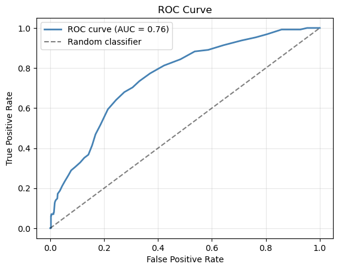
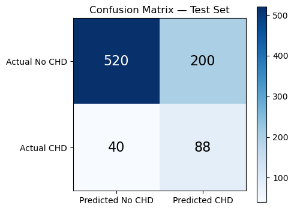

# CHD---Logistic-Regression
Logistic Regression from scratch for predicting 10-year Coronary Heart Disease (CHD) risk using the Framingham dataset.
# Logistic Regression for Coronary Heart Disease (CHD) Prediction

## Project Overview

This project implements Logistic Regression from scratch using Python and NumPy to predict the 10-year risk of Coronary Heart Disease (CHD) using the Framingham Heart Study dataset.

The objective is to build and evaluate a binary classification model capable of identifying individuals at risk of developing CHD based on demographic, lifestyle, and clinical health indicators.

## Dataset

The dataset contains patient information including:

* Gender
* Age
* Education
* Smoking status
* Cigarettes per day
* Blood pressure medication usage
* History of stroke
* Hypertension
* Diabetes
* Total cholesterol
* Systolic blood pressure
* Diastolic blood pressure
* BMI
* Heart rate
* Glucose level

Target Variable:

* TenYearCHD

  * 1 = Patient develops CHD within 10 years
  * 0 = No CHD within 10 years

## Project Workflow

1. Data Cleaning and Preprocessing
2. Feature Normalization
3. Train/Test Split
4. Logistic Regression Implementation from Scratch
5. Gradient Descent Optimization
6. Model Evaluation
7. Confusion Matrix Analysis
8. ROC Curve and AUC Analysis
9. Threshold Tuning
10. New Patient Risk Prediction

## Model Performance

### Default Threshold (0.50)

* Test Accuracy: 85.5%
* Recall: 7.0%
* F1 Score: 0.128

Although the model achieved high accuracy, it identified only a small percentage of actual CHD cases due to class imbalance.

### ROC Analysis
### ROC Curve

* AUC: 0.76

The ROC curve indicates that the model has reasonable discriminatory power and is capable of distinguishing between CHD and non-CHD patients.

### Threshold Optimization

Threshold tuning was performed to improve the balance between Precision and Recall.

* Best Threshold: 0.23
* Best F1 Score: 0.423

Lowering the classification threshold significantly improved the model's ability to identify patients at risk of CHD.

### Confusion Matrix 
### Final Confusion Matrix (Threshold = 0.23)

Using the optimized threshold of 0.23, the model produced the following results:

- True Positives (TP): 88
- True Negatives (TN): 520
- False Positives (FP): 200
- False Negatives (FN): 40

This means the model correctly identified 88 patients who were at risk of developing CHD and correctly classified 520 patients who were not at risk.

Compared to the default threshold of 0.50, lowering the threshold significantly improved the model's ability to detect CHD cases, increasing Recall from 7.0% to 68.7%.

While the model generated more false alarms (200 false positives), it reduced the number of missed CHD patients to only 40. In a healthcare setting, identifying more at-risk patients is often preferred over missing potential disease cases.

Performance at the optimized threshold:

- Precision: 30.6%
- Recall: 68.7%
- F1 Score: 0.423

The optimized threshold provided the best balance between Precision and Recall and achieved the highest F1 score during threshold tuning.
## Technologies Used

* Python
* NumPy
* Pandas
* Matplotlib
* Jupyter Notebook

## Key Learning Outcomes

* Logistic Regression implementation from scratch
* Feature normalization
* Gradient Descent optimization
* Model evaluation using Accuracy, Precision, Recall, and F1 Score
* Confusion Matrix interpretation
* ROC Curve and AUC analysis
* Threshold tuning for imbalanced datasets

## Author

Prachi Patel
